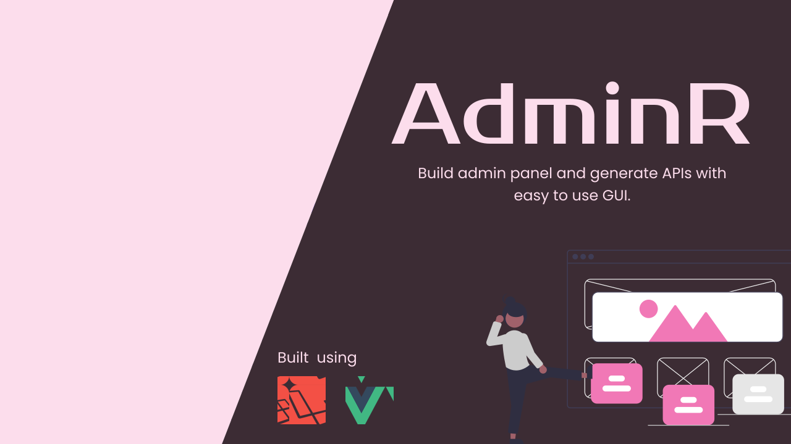

# AdminR v0.4.7

<p align="center">
<a href="https://packagist.org/packages/thedevsbuddy/adminr"></a>
<a href="https://packagist.org/packages/thedevsbuddy/adminr"></a>
<a href="https://packagist.org/packages/thedevsbuddy/adminr"></a>
</p>

---

## WARNING: I would like to inform you that this project is currently undergoing significant modifications, and will soon be released in a stable (`v1.0`).

I am currently engaged in a comprehensive redevelopment of this project with the aim of improving its stability and optimization. The undertaking involves the implementation of a new project structure as well as the generation of new resources to support its objectives.

After careful consideration, I have decided to forego the pursuit of a new project. Given the current breadth of my existing project and my sole contribution to it, I find it unnecessary to initiate a separate undertaking. Additionally, as I am employed full-time, I am unable to dedicate the requisite resources to a new project solely for the purposes of introducing an update. Accordingly, I have concluded that it is most prudent to allow the existing project to evolve under its current name.

---



## About AdminR

AdminR is a simple admin panel built on top of [Laravel Framework](https://laravel.com) to help developers create laravel backend and APIs with ease so they can more focus on creating actual web app or any client side apps.

AdminR help to reduce approx 90% of the work for developers which they do to build a backend or admin panel and the APIs for their apps.

## Known Issues

### I am aware of (and fixing them)

-   No issue known.
-   **Please report issues in issue tab if found any issue**

## Future plans

### I am preparing to add

-   `indexing` option for resource generation (on `SQL` level).
-   DataTable option for every resource
    -   You will have an option to select whether to use datatable or native table.
    -   Import export options on resources.
-   Search option for resources.
-   Many more features.

---

## Support me

If you found this package helpful you can show support by clicking on the following button below and donating some amount to help me work on these projects frequently.

<a href="https://www.buymeacoffee.com/iamspydey" target="_blank">
    
</a>

---

## Get Started

Install the project

```bash
composer create-project thedevsbuddy/adminr <your-app-name>
```

Generate app key

```bash
php artisan key:generate
```

Setup / update database connection

```env
DB_CONNECTION=mysql
DB_HOST=127.0.0.1
DB_PORT=3306
DB_DATABASE=adminr
DB_USERNAME=root
DB_PASSWORD=secret
```

Migrate database and seed demo data

```bash
php artisan migrate --seed
```

Link storage folder

```bash
php artisan storage:link
```

By default, you will get `3` users and role

```text

Super admin (super.admin)
email: super.admin@adminr.com
pwd: password

Admin (admin)
email: admin@adminr.com
pwd: password

User (user)
email: user@adminr.com
pwd: password
```

That's it your project setup is completed.

Happy coding.

### Special thanks to

#### CoreUI

For the admin panel UI we have used [coreui](https://coreui.io) which is an awesome admin template out there.

## Security Vulnerabilities

If you discover a security vulnerability within AdminR, please send an e-mail to Devsbuddy via [adminr@devsbuddy.com](mailto:adminr@devsbuddy.com). All security vulnerabilities will be promptly addressed.

## License

The AdminR is open-source software licensed under the [MIT license](https://opensource.org/licenses/MIT).
